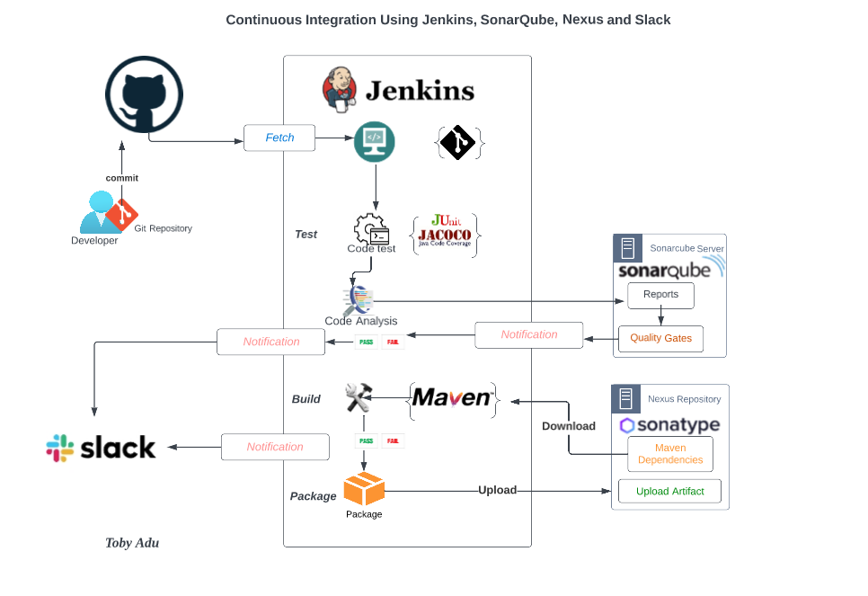
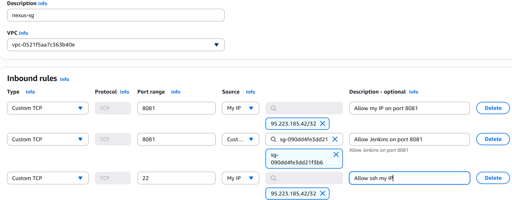
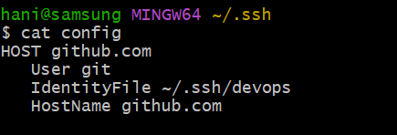

# DevOps Pipeline on AWS with Jenkins, Nexus, and SonarQube

This project demonstrates a **complete CI/CD pipeline** on AWS using **Jenkins**, **Nexus**, **SonarQube**, and **GitHub**.  
The pipeline automates **build → test → artifact management → code quality checks → notifications**.  

---

## 📊 Architecture Overview

  
*(Diagram showing AWS EC2 instances for Jenkins, Nexus, SonarQube, integrated with GitHub and Slack)*  

---

## 🚀 Features
- Automated AWS setup for Jenkins, Nexus, SonarQube
- CI/CD with GitHub integration
- Nexus artifact storage (release, snapshot, proxy repos)
- SonarQube for continuous code quality checks
- Slack build notifications
- Multi-Git account support

---

## 🛠️ AWS Setup


1. **Login to AWS Account**  
   - Use AWS Console to provision EC2 instances  

2. **Create Key Pair**  
   - Secure authentication for EC2 instances  

3. **Security Groups**  
   - Open required ports for Jenkins (8080), Nexus (8081), SonarQube (9000)  

---

## 💻 EC2 Instances

### Jenkins Instance  


- **AMI:** Ubuntu  
- **Type:** `t2.small`  
- **Plugins Installed:** Maven, GitHub, Nexus Artifact Uploader, SonarQube Scanner, Slack, etc.  

---

### Nexus Instance  



- **AMI:** Amazon Linux 2023  
- **Type:** `t2.medium`  
- **Repositories Created:**  
  - `vprofile-release` (hosted)  
  - `vprofile-snapshot` (hosted)  
  - `vpro-maven-central` (proxy)  
  - `maven-group` (group repo)  

---

### SonarQube Instance  


- **AMI:** Ubuntu  
- **Type:** `t2.medium`  
- Integrated with Jenkins for code analysis  

---

## 🔧 Git Integration



- Create SSH keys and add them to GitHub  
- Configure `~/.ssh/config` for multiple accounts  
- Example:  
  ```bash
  git clone git@github.com-X:azizi-devops/vprofile-project.git
  ```

---

## 🔄 CI/CD Pipeline Stages


1. Build Job with Nexus Integration  
2. GitHub Webhooks → Jenkins Trigger  
3. SonarQube Code Quality Analysis  
4. Artifact Upload to Nexus  
5. Slack Notifications  

---

## 📂 Source Code
👉 [GitHub Repository](https://github.com/azizi-devops/Jenkins/tree/jenkins-ci)  

