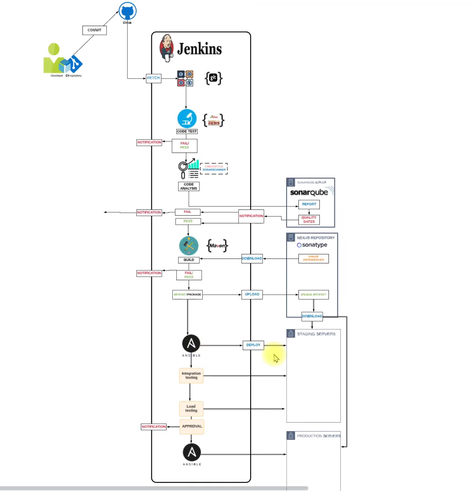
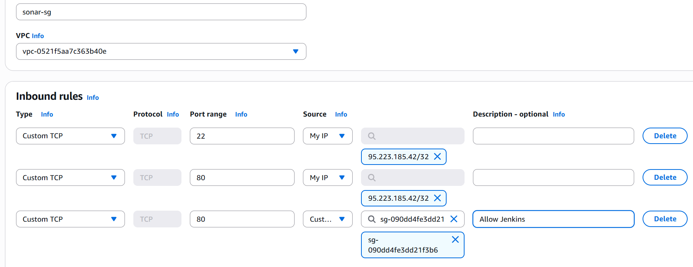
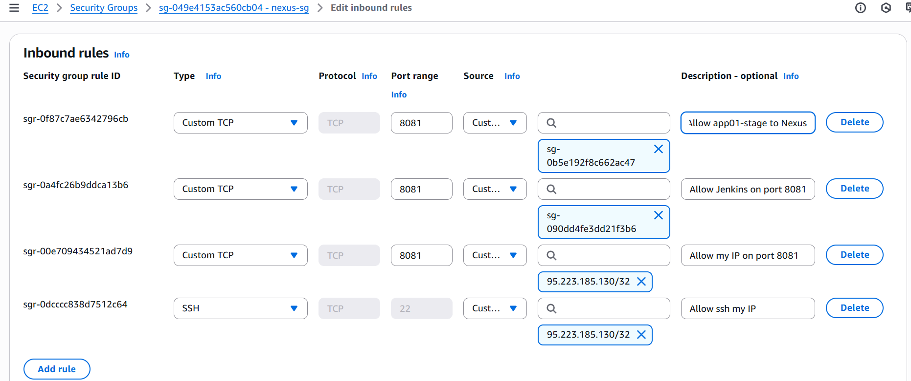
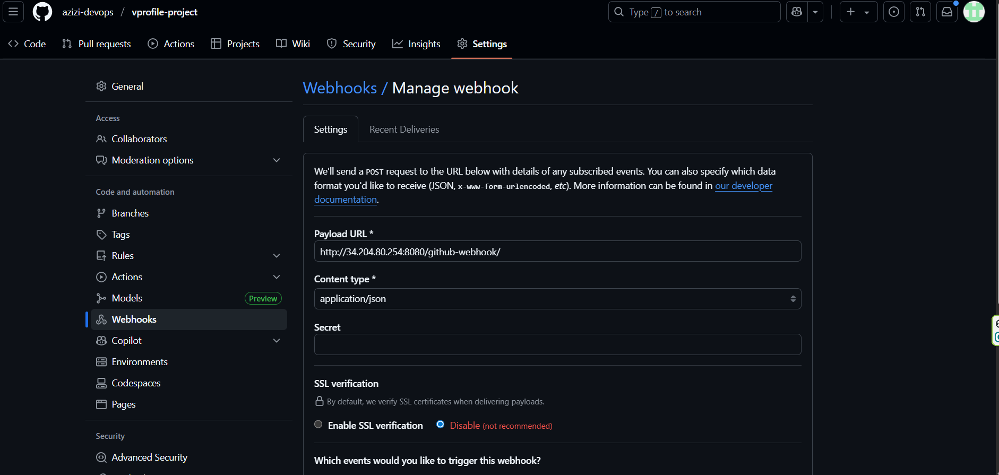
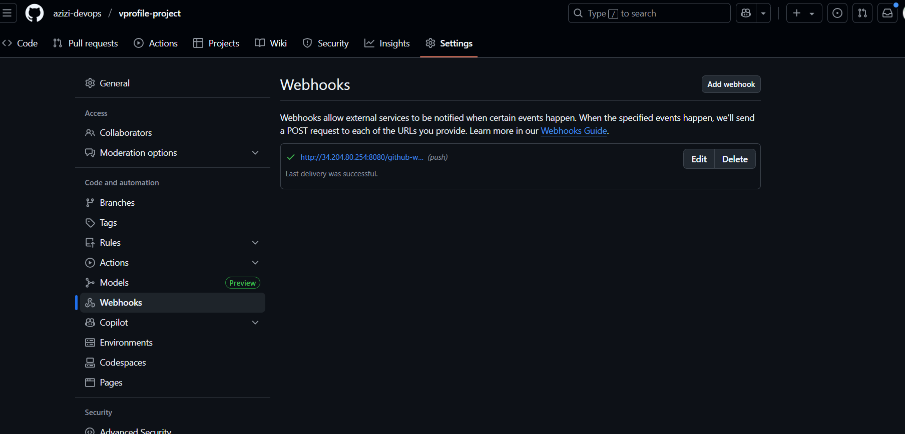
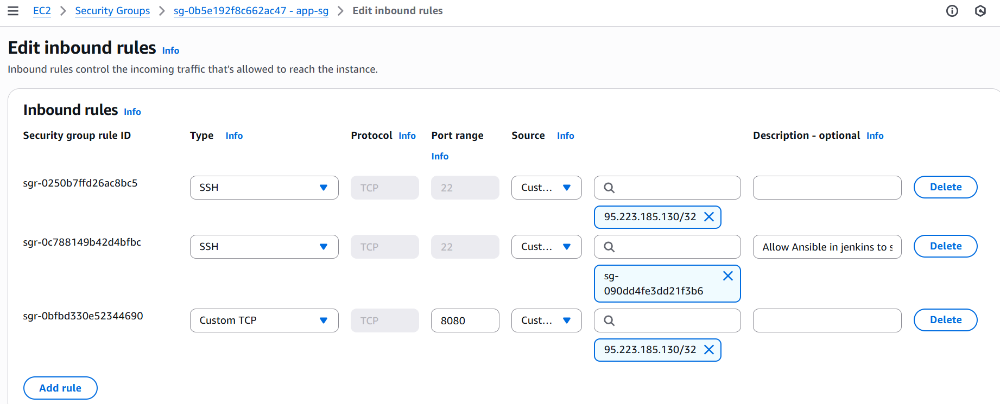
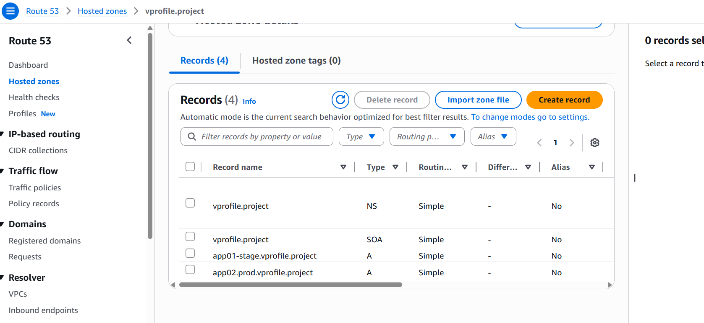

# Prerequisites
######
- JDK 17 or 21
- Maven 3.9
- MySQL 8
####
# Technologies 
- Spring MVC
- Spring Security
- Spring Data JPA
- Maven
- JSP
- Tomcat
- MySQL
- Memcached
- Rabbitmq
- ElasticSearch
# Database
Here,we used Mysql DB 
sql dump file:
- /src/main/resources/db_backup.sql
- db_backup.sql file is a mysql dump file.we have to import this dump to mysql db server
- > mysql -u <user_name> -p accounts < db_backup.sql
################################################################################
# Continuous Delivery and Configuration Management (Jenkins + Ansible)

## AWS Setup

1. **Login to AWS Account**

   * Access the AWS Management Console to configure resources.

2. **Create Key Pair**

   * Generate a secure key pair to authenticate EC2 instances.

3. **Security Group Configuration**

   * Create security groups for Jenkins, Nexus, and SonarQube to ensure proper firewall rules for each application.





## EC2 Instances Creation

### Jenkins

* OS: Ubuntu, t2.small, Volume: 15 GB
* Steps:

  * Provision EC2 instance with necessary user-data for initialization.
  * After login:

    ```bash
    systemctl status jenkins
    ls /var/lib/jenkins
    ```
  * Login to Jenkins on port 8080 and install plugins.

### Nexus

* OS: Amazon Linux 2023, t2.medium
* Steps:

  * Provision EC2 instance and automate installation with user-data.
  * Login to Nexus on port 8081.

### SonarQube

* OS: Ubuntu, t2.medium
* Steps:

  * Launch EC2 instance and configure user-data for automatic setup.
  * Test login and integration with Jenkins.

---

## Post-Installation Setup

### Jenkins Configuration

* Install necessary plugins:

  1. Maven Integration
  2. GitHub Integration
  3. Nexus Artifact Uploader
  4. SonarQube Scanner
  5. Slack Notification
  6. Build Timestamp
* Set up pipelines for CI/CD.

### Nexus Setup

* Configure repositories:

  1. `vprofile-release` (Maven hosted) - store release artifacts
  2. `vprofile-snapshot` (Maven hosted) - store snapshot artifacts
  3. `vpro-maven-central` (Maven proxy) - fetch dependencies from Maven Central
  4. Maven group - include all above repositories

### SonarQube Setup

* Ensure proper integration with Jenkins for continuous code quality checks.

---

## Git Integration

1. **Create GitHub Repository**

   * Set up a repository for version-controlled code.
   * Migrate existing code to this repository.

2. **SSH Key Setup**

   * Generate a new SSH key, save the public key in GitHub.
   * Create `~/.ssh/config`:

     ```
     Host github.com-X
         HostName github.com
         User git
         IdentityFile ~/.ssh/id_rsa_X
     ```
   * Clone repository:

     ```bash
     git clone git@github.com-X:azizi-devops/vprofile-project.git
     ```

3. **VS Code Integration**

   * Integrate repository with VS Code and verify synchronization.

---

## CI/CD Pipeline Stages

1. **Build Job with Nexus Integration**

   * Jenkins pipelines pull and push artifacts from Nexus.

2. **GitHub Webhooks**

   * Configure webhooks to trigger Jenkins builds on commits.


3. **Integration**

   * Integrate SonarQube with Jenkins for code quality checks.

4. **Nexus Artifact Upload**

   * Automate uploading of build artifacts to Nexus.

5. **Slack Notifications**

   * Notify team on build status.

* **Source Code**: [vprofile-project/jenkins-ci](https://github.com/azizi-devops/vprofile-project/tree/jenkins-ci)

---

## Stage Deployment with Ansible

1. **Launch Stage Instance**

   * `app01-stage`, Ubuntu, t2.micro
   * Create key-pair `app-key`
   * security group
     
   * Configure Route 53 A record for private IP
      
   * Add instance credentials in Jenkins (username: ubuntu, key: app-key.pem)

2. **Install Ansible in Jenkins**

   * Install Ansible and Ansible plugin in Jenkins.

3. **Prepare Source Code**

   * Checkout `jenkins-ci` branch
   * Create `jenkins-ansible-cicd` branch
   * Copy `ansible` folder from `devopshydclub/vprofile-project` repository
   * Commit and push changes
   * Create `stage.inventory`:

     ```ini
     [appsrvgrp]
     app01-stage.vprofile.project
     ```

4. **Pipeline Trigger**

   * Push changes → Jenkins pipeline runs
   * Access deployed application: `http://<app01-stage-public-ip>:8080`


