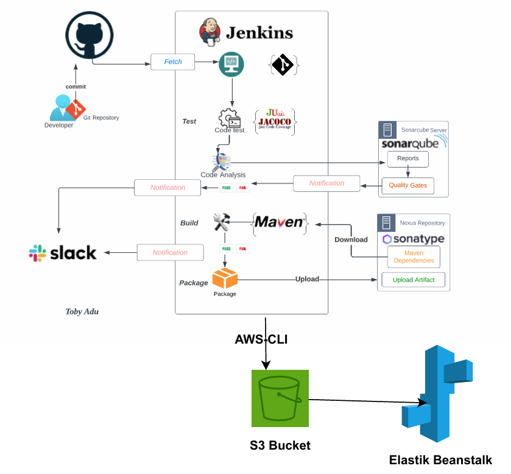
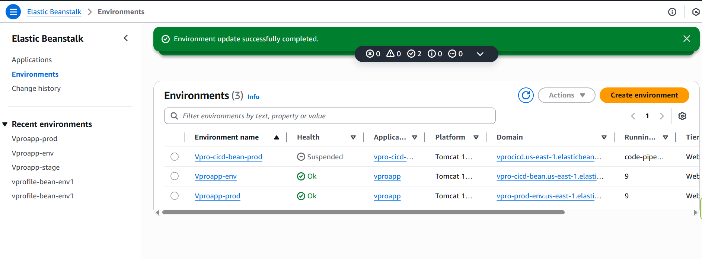
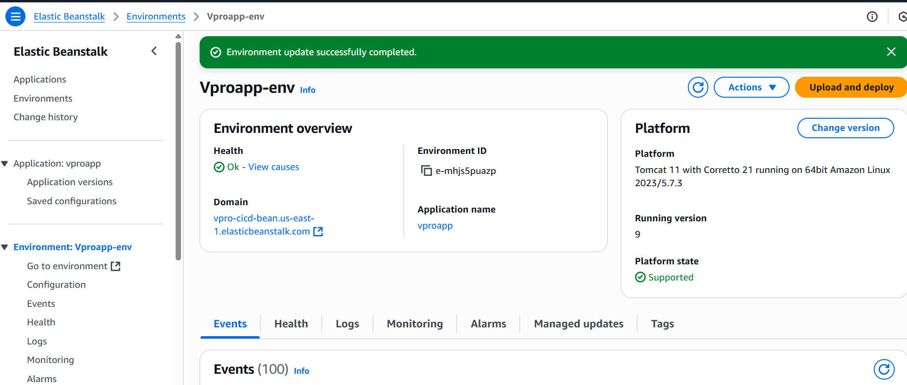
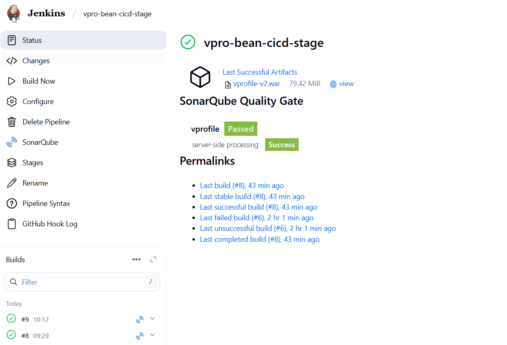
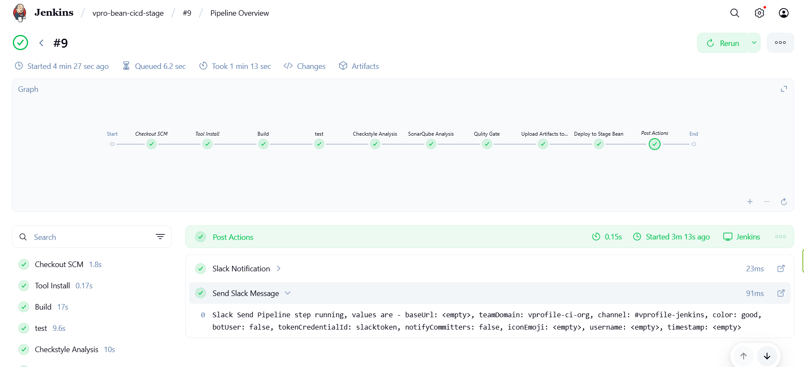
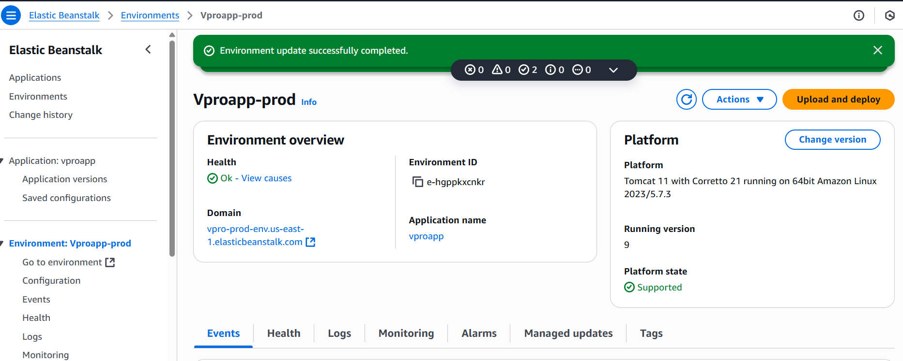
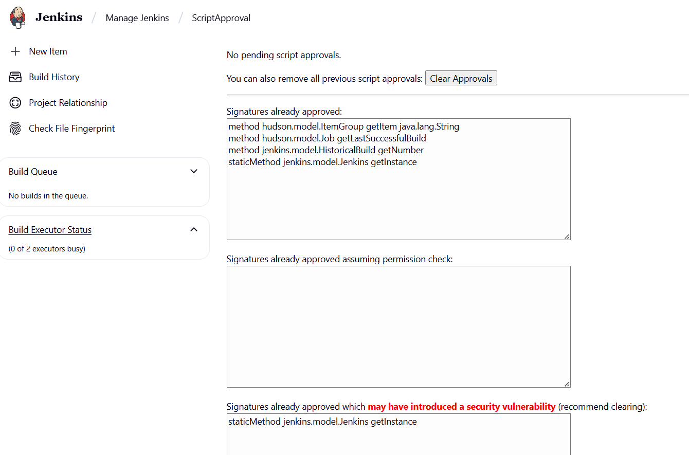
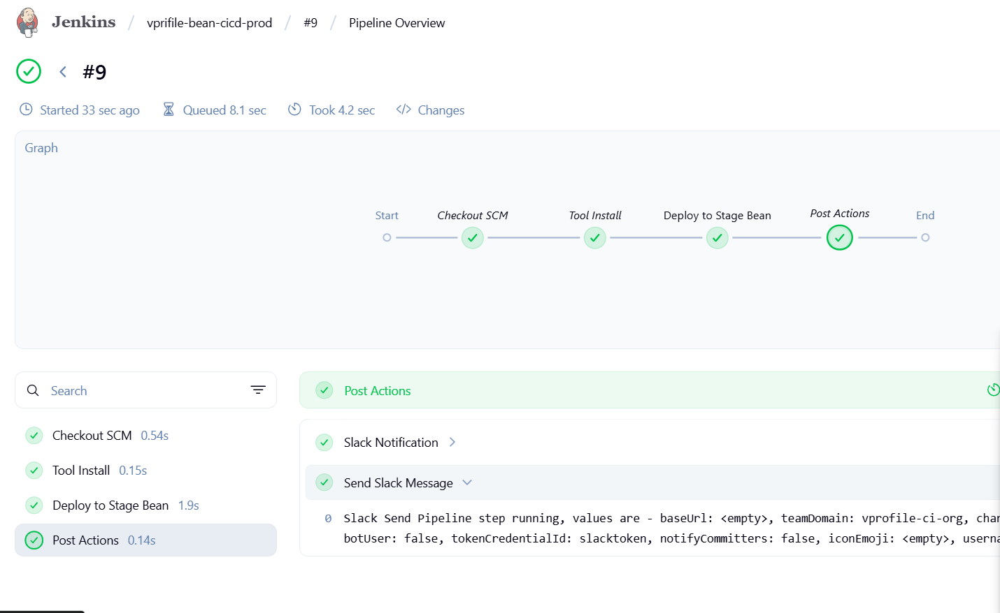

#  Hybrid Continuous Delivery CI/CD Pipeline Project


This project demonstrates how to set up a **complete CI/CD pipeline** using Jenkins, AWS Elastic Beanstalk, AWS S3, SonarQube, Nexus Repository, and other key DevOps tools.  
The pipeline builds, tests, stores, and deploys an application in both **development** and **production environments**.

---

## Tools Overview

### CI/CD & Code Quality
- **Jenkins** – Automation server for building and deploying
- **Maven** – Build automation tool for compiling and packaging
- **SonarQube** – Code quality and vulnerability scanning
- **Nexus Sonatype Repository** – Artifact repository to store build outputs
- **Git** – Version control for source code

### Collaboration & Cloud
- **Slack** – Team communication and pipeline notifications
- **AWS Elastic Beanstalk** – Application deployment service
- **AWS CLI** – Command-line interface to interact with AWS
- **AWS S3** – Cloud storage for artifacts and static files

---

## ⚙️ Prerequisites

Before starting, ensure you have:

- GitHub account and repository for your code
- AWS account with permissions for:
  - **S3**
  - **IAM**
  - **Elastic Beanstalk**
- Jenkins server installed and running
- SonarQube server set up and accessible
- Nexus Repository Manager set up
- Slack workspace (optional, for notifications)
- Java & Maven installed where Jenkins runs

---

## 🛠️ Step-by-Step Setup

### Step 1: Validate CI Environment

1. Open Jenkins and ensure:
   - Maven plugin is installed
   - Git plugin is installed
   - SonarQube plugin is configured
2. Install **AWS CLI** on the Jenkins server.
3. Install **AWS CLI Plugin** in Jenkins:
   - Navigate to `Manage Jenkins → Plugins → Available plugins`
   - Search for **AWS Steps** or **AWS CLI**
   - Install and restart Jenkins
4. Configure AWS credentials:
   - Go to `Manage Jenkins → Manage Credentials`
   - Add Access Key & Secret Key securely
5. Test AWS CLI connection:
   ```bash
   aws sts get-caller-identity


   
Step 2: Create Git Branch for CI/CD
- Clone your repository and create a new branch:
  git checkout -b ci-jenbean-stage
  git push origin ci-jenbean-stage


Step 3: AWS Setup
- Create S3 Bucket
  aws s3 mb s3://vproapp-artifacts
- Create IAM User
  Name: jenkins-deployer
- Policies:
  AmazonS3FullAccess
  AWSElasticBeanstalkFullAccess

- Save the Access & Secret Keys securely.
 - Create Elastic Beanstalk Application
   aws elasticbeanstalk create-application --application-name vproapp



Step 4: Jenkinsfile for Development
- Pipeline stages:
  Checkout code from GitHub
  Compile and package using Maven
  Run SonarQube analysis
  Push artifact to Nexus Repository
  Upload artifact to S3
  Deploy to Beanstalk (stage environment)
  Use Jenkins AWS CLI plugin for deployment steps.



Step 5: Test the Development Pipeline
- Commit Jenkinsfile to ci-jenbean-stage branch
  Run Jenkins build manually
- Verify:
  SonarQube report is generated
  Artifact is stored in Nexus and S3
  Beanstalk stage environment is updated




Step 6: Setup Production Pipeline
- Create new Beanstalk environment for production
  Create a new Git branch:
  git checkout -b ci-jenbean-prod
  git push origin ci-jenbean-prod
  In the production Jenkinsfile:
  Change Beanstalk environment to vproapp-prod
  Enable Slack notifications for deployment status



Step 7: Run Production Deployment
- Merge tested code from ci-jenbean-stage → ci-jenbean-prod
  Jenkins pipeline triggers automatically

  ***Note***
 You may encounter an error like this during execution:

Click on the sentence with the red underline to open another page for approval. Repeat this process 4 times, and in the end, you will have a page like the one shown below:

After that your pipline runs seccessfully .


- Verify:
  Deployment is successful in production environment
  Notifications sent to Slack

✅ Final Notes
This CI/CD pipeline provides:

Automated builds & tests

Continuous quality checks via SonarQube

Secure artifact storage in Nexus & S3

Automated deployments with AWS Elastic Beanstalk

Notifications integrated with Slack

👨‍💻 Author: Hani Karim Azizi 📂 Repo: azizi-devops/vprofile-project
