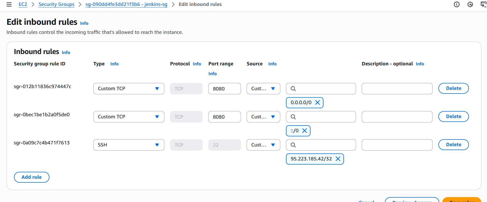

# DevOps Pipeline on AWS with Jenkins, Nexus, and SonarQube

<<<<<<< HEAD
This project demonstrates a **complete CI/CD pipeline** on AWS using **Jenkins**, **Nexus**, **SonarQube**, and **GitHub**.  
The pipeline automates **build → test → artifact management → code quality checks → notifications**.  
=======
#####################################################################################################################################################

# 🚀 DevOps CI/CD Pipeline on AWS

This project outlines a comprehensive CI/CD pipeline using **AWS**, **Jenkins**, **Nexus**, and **SonarQube** to automate build, test, and deployment processes.

---

## 📸 Jenkins Dashboard


---

## 🛠️ AWS Setup

- **Login to AWS Console**
- **Create Key Pair** for EC2 authentication
- **Configure Security Groups** for Jenkins, Nexus, and SonarQube
- **Launch EC2 Instances**:
  - Jenkins: Ubuntu, t2.small, 15GB
  - Nexus: Amazon Linux 2023, t2.medium
  - SonarQube: Ubuntu, t2.medium

---

## ⚙️ Jenkins Configuration

- Install plugins:
  - Maven Integration
  - GitHub Integration
  - Nexus Artifact Uploader
  - SonarQube Scanner
  - Slack Notification
  - Build Timestamp
- Access Jenkins on port `8080`

---

## 📦 Nexus Repository Setup

- Access Nexus on port `8081`
- Create repositories:
  1. `vprofile-release` (hosted)
  2. `vprofile-snapshot` (hosted)
  3. `vpro-maven-central` (proxy)
  4. `vprofile-group` (group)

---

## 🔍 SonarQube Integration

- Launch and configure SonarQube
- Integrate with Jenkins for code quality analysis

---

## 🧬 GitHub Integration

- Create GitHub repo
- Generate SSH key and configure `~/.ssh/config`
- Clone using custom host alias:
  ```bash
  git clone git@github.com-X:azizi-devops/vprofile-project.git

>>>>>>> 772caf3e56e10845b3bc65c51bcbadb731b5f00b

---

## 📊 Architecture Overview

  
*(Diagram showing AWS EC2 instances for Jenkins, Nexus, SonarQube, integrated with GitHub and Slack)*  

---

## 🚀 Features
- Automated AWS setup for Jenkins, Nexus, SonarQube
- CI/CD with GitHub integration
- Nexus artifact storage (release, snapshot, proxy repos)
- SonarQube for continuous code quality checks
- Slack build notifications
- Multi-Git account support

---

## 🛠️ AWS Setup



1. **Login to AWS Account**  
   - Use AWS Console to provision EC2 instances  

2. **Create Key Pair**  
   - Secure authentication for EC2 instances  

3. **Security Groups**  
   - Open required ports for Jenkins (8080), Nexus (8081), SonarQube (9000)  

---

## 💻 EC2 Instances

### Jenkins Instance  


- **AMI:** Ubuntu  
- **Type:** `t2.small`  
- **Plugins Installed:** Maven, GitHub, Nexus Artifact Uploader, SonarQube Scanner, Slack, etc.  

---

### Nexus Instance  


- **AMI:** Amazon Linux 2023  
- **Type:** `t2.medium`  
- **Repositories Created:**  
  - `vprofile-release` (hosted)  
  - `vprofile-snapshot` (hosted)  
  - `vpro-maven-central` (proxy)  
  - `maven-group` (group repo)  

---

### SonarQube Instance  


- **AMI:** Ubuntu  
- **Type:** `t2.medium`  
- Integrated with Jenkins for code analysis  

---

## 🔧 Git Integration


- Create SSH keys and add them to GitHub  
- Configure `~/.ssh/config` for multiple accounts  
- Example:  
  ```bash
  git clone git@github.com-X:azizi-devops/vprofile-project.git
  ```

---

## 🔄 CI/CD Pipeline Stages


1. Build Job with Nexus Integration  
2. GitHub Webhooks → Jenkins Trigger  
3. SonarQube Code Quality Analysis  
4. Artifact Upload to Nexus  
5. Slack Notifications  

---

## 📂 Source Code
👉 [GitHub Repository](https://github.com/azizi-devops/Jenkins/tree/jenkins-ci)  

---

## 📸 Screenshots Needed
✅ Jenkins Dashboard  
✅ Nexus Repository Configuration  
✅ SonarQube Analysis Report  
✅ Slack Notification Example  
✅ VS Code Integration  

*(Upload screenshots into an `images/` folder and update the links in this README.)*  

---

## 📌 Requirements
- AWS Account  
- GitHub Account  
- Slack Workspace  
- VS Code (optional for development)  

---

## 📜 License
MIT License – see the [LICENSE](LICENSE) file for details  
