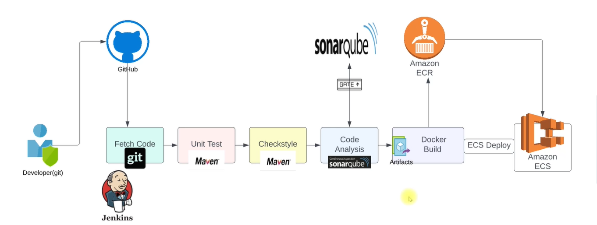

# Prerequisites
####
- JDK 17 or 21
- Maven 3.9
- MySQL 8
####
# Technologies 
- Spring MVC
- Spring Security
- Spring Data JPA
- Maven
- JSP
- Tomcat
- MySQL
- Memcached
- Rabbitmq
- ElasticSearch
# Database
Here,we used Mysql DB 
sql dump file:
- /src/main/resources/db_backup.sql
- db_backup.sql file is a mysql dump file.we have to import this dump to mysql db server
- > mysql -u <user_name> -p accounts < db_backup.sql

################################################################################################################################################################################################
# 🚀 Continuous Delivery of Java Web Application on AWS

This project demonstrates how to set up a complete **CI/CD pipeline** for deploying a Java web application on **AWS ECS** using modern DevOps tools.

---

## 📌 Prerequisite Tools

The following tools are used in this project:

- **Jenkins** → Automating the CI/CD process  
- **Nexus Sonatype** → Repository for Maven dependencies and artifacts  
- **SonarQube** → Code quality and static analysis  
- **Maven** → Build automation for Java artifacts  
- **Git** → Version control for source and pipeline code  
- **Slack** → Real-time notifications during pipeline execution  
- **Docker** → Build Docker images from Java artifacts  
- **Amazon ECR** → Store built Docker images  
- **Amazon ECS** → Host and manage Docker containers  
- **AWS CLI** → Automate deployments from Jenkins  

---

## 📂 Project Structure

```
.
├── Docker-files/
│   └── app/multistage/Dockerfile
├── prodPipline/
│   └── Jenkinsfile
├── stagePipline/
│   └── Jenkinsfile
├── pom.xml
├── README.md
└── settings.xml
```

---

## ⚙️ CI/CD Pipeline Workflow

1. **GitHub Webhook** → Triggers Jenkins pipeline on code push  
2. **Build Stage** → Maven builds `.war` artifact  
3. **Unit Tests** → Maven runs unit tests  
4. **Checkstyle & SonarQube** → Code quality and analysis  
5. **Artifact Upload** → Push artifacts to Nexus Repository  
6. **Docker Build** → Create Docker image using multistage Dockerfile  
7. **Push to ECR** → Push image to Amazon Elastic Container Registry  
8. **Deploy to ECS** → Update ECS service with latest image  
9. **Slack Notifications** → Notify team on success/failure  

---

## 🖼️ Pipeline Architecture



---

## 🖼️ Jenkins Pipeline View


---

## 🖼️ ECS Deployment


---

## 🔑 Key Jenkinsfiles

### Staging Pipeline (`stagePipline/Jenkinsfile`)
- Build & test  
- Code quality analysis  
- Upload to Nexus  
- Build & push Docker image to ECR  
- Deploy to ECS (staging)  

### Production Pipeline (`prodPipline/Jenkinsfile`)
- Pull latest Docker image from ECR  
- Deploy to ECS (production)  

---

## 🐳 Multistage Dockerfile

```dockerfile
FROM maven:3.9.9-eclipse-temurin-21-jammy AS BUILD_IMAGE
RUN git clone https://github.com/hkhcoder/vprofile-project.git
RUN cd vprofile-project && git checkout docker && mvn install

FROM tomcat:10-jdk21
RUN rm -rf /usr/local/tomcat/webapps/*
COPY --from=BUILD_IMAGE vprofile-project/target/vprofile-v2.war /usr/local/tomcat/webapps/ROOT.war

EXPOSE 8080
CMD ["catalina.sh", "run"]
```

---

## 🌍 Deployment Strategy

- **Staging →** Software & load testing  
- **Production →** ECS deployment with Load Balancer  

This ensures smooth and automated deployments with minimal downtime.

---

## 📚 Source Code

👉 [azizi-devops/vprofile-project](https://github.com/azizi-devops/vprofile-project)

---

## ✅ Outcome

- Faster development cycles  
- Automated build & deployment  
- Scalable ECS-based architecture  
- Continuous feedback via Slack & SonarQube  

---

## 📸 Screenshots

- Pipeline Overview  
  

- Nexus Artifacts  
  

- SonarQube Reports  
  

---
